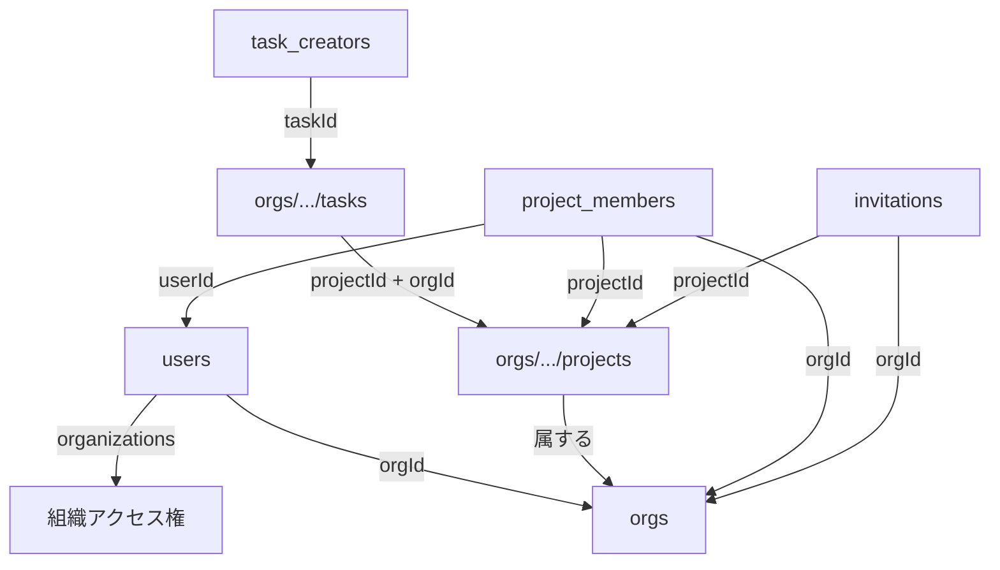

# Firestore データベース構造ガイド

## 📋 目次
1. [コレクション一覧](#コレクション一覧)
2. [コレクション間の関係性](#コレクション間の関係性)
3. [各コレクションの詳細](#各コレクションの詳細)
4. [権限システム](#権限システム)
5. [データフロー](#データフロー)
6. [移行履歴](#移行履歴)

---

## コレクション一覧

```
Firestore
├── /users/{userId}                           # ユーザー情報
├── /orgs/{orgId}                             # 組織情報
│   ├── /projects/{projectId}                 # プロジェクト
│   │   └── /members/{userId}                 # プロジェクトメンバー（サブコレクション）
│   ├── /tasks/{taskId}                       # タスク
│   └── /people/{personId}                    # 人員マスタ
├── /project_members/{memberId}               # プロジェクトメンバー（トップレベル）
├── /invitations/{invitationId}               # プロジェクト招待
└── /task_creators/{taskId}                   # タスク作成者記録
```

---

## コレクション間の関係性

### 🔗 データの参照関係



### 📊 主キー関係

| コレクション | ドキュメントID | 参照フィールド |
|------------|---------------|---------------|
| `/users/{userId}` | Firebase Auth UID | `orgId` (primary org) |
| `/orgs/{orgId}/projects/{projectId}` | `P-0001` 形式 | - |
| `/orgs/{orgId}/tasks/{taskId}` | `T001` 形式 | `projectId`, `orgId` |
| `/project_members/{memberId}` | `{projectId}_{userId}` | `userId`, `projectId`, `orgId` |
| `/invitations/{invitationId}` | 自動生成 | `projectId`, `orgId`, `email` |

---

## 各コレクションの詳細

### 1. `/users/{userId}` - ユーザー情報

**用途**: 認証済みユーザーの基本情報と組織アクセス権を管理

**主要フィールド**:
```typescript
{
  email: string;                    // メールアドレス
  displayName?: string;             // 表示名
  orgId: string;                    // プライマリ組織ID
  organizations?: {                 // 複数組織のアクセス権
    [orgId: string]: {
      role: 'owner' | 'admin' | 'member' | 'guest';
      joinedAt: Timestamp;
      accessLevel: 'full' | 'project-specific';
      projects?: string[];          // project-specificの場合のみ
    }
  };
  createdAt: Timestamp;
  updatedAt: Timestamp;
}
```

**重要な点**:
- ユーザーは複数の組織に所属できる（`organizations` フィールド）
- `orgId` はプライマリ（デフォルト）の組織を示す
- 組織レベルの権限は `organizations[orgId].role` で管理

---

### 2. `/orgs/{orgId}` - 組織情報

**用途**: 組織のデータを隔離して管理

**サブコレクション**:
- `/projects/{projectId}` - プロジェクト
- `/tasks/{taskId}` - タスク
- `/people/{personId}` - 人員マスタ

**データ隔離**:
```
組織A (archi-prisma)
├── プロジェクトA1
│   └── タスクA1-1, A1-2, ...
└── プロジェクトA2
    └── タスクA2-1, A2-2, ...

組織B (other-company)
├── プロジェクトB1
│   └── タスクB1-1, B1-2, ...
└── プロジェクトB2
    └── タスクB2-1, B2-2, ...
```

---

### 3. `/orgs/{orgId}/projects/{projectId}` - プロジェクト

**用途**: プロジェクトの基本情報を管理

**主要フィールド**:
```typescript
{
  id: string;                       // プロジェクトID (例: P-0001)
  物件名: string;                   // プロジェクト名
  クライアント?: string;
  LS担当者?: string;
  自社PM?: string;
  ステータス: string;               // 例: 進行中, 完了
  優先度: string;                   // 例: 高, 中, 低
  開始日?: string;
  予定完了日?: string;
  // ... その他のフィールド
  createdAt: Timestamp;
  updatedAt: Timestamp;
}
```

**アクセス方法**:
```javascript
// プロジェクトを取得
const project = await getProject(orgId, projectId);
```

---

### 4. `/orgs/{orgId}/tasks/{taskId}` - タスク

**用途**: プロジェクトのタスクを管理

**主要フィールド**:
```typescript
{
  id: string;                       // タスクID (例: T001)
  projectId: string;                // 所属プロジェクトID
  orgId: string;                    // ★重要: タスクが属する組織ID
  タスク名: string;
  タスク種別?: string;
  担当者?: string;
  assignee?: string;                // ユーザーID
  担当者メール?: string;
  ステータス: string;               // 例: 未着手, 進行中, 完了
  優先度?: string;
  予定開始日?: string;
  期限?: string;
  実績開始日?: string;
  実績完了日?: string;
  工数見積(h)?: number;
  工数実績(h)?: number;
  依存タスク?: string[];            // 依存する他のタスクID
  通知設定?: {
    開始日: boolean;
    期限前日: boolean;
    期限当日: boolean;
    超過: boolean;
  };
  マイルストーン?: boolean;         // マイルストーンフラグ
  createdAt: Timestamp;
  updatedAt: Timestamp;
}
```

**重要な変更点**:
- **`orgId` フィールドを追加** (2025-01-XX)
  - タスクがどの組織のプロジェクトに属するかを明示
  - これにより、`projectId` からプロジェクト情報を取得できる

**なぜ orgId が必要か**:
```javascript
// ❌ 以前: projectId だけではどの組織か不明
const project = await getProject(???, task.projectId);  // orgId がわからない!

// ✅ 現在: orgId があるので取得可能
const project = await getProject(task.orgId, task.projectId);
```

---

### 5. `/project_members/{memberId}` - プロジェクトメンバー

**用途**: プロジェクトへのメンバー参加を管理（クロスオーガナイゼーション対応）

**ドキュメントID**: `{projectId}_{userId}` (例: `P-0001_abc123xyz`)

**主要フィールド**:
```typescript
{
  id: string;                       // memberId
  projectId: string;                // プロジェクトID
  userId: string;                   // ユーザーID
  email: string;
  displayName: string;
  orgId: string;                    // メンバーの所属組織ID
  orgName: string;
  role: 'owner' | 'manager' | 'member' | 'viewer';
  職種?: string;
  permissions: {
    canEditProject: boolean;
    canDeleteProject: boolean;
    canManageMembers: boolean;
    canViewTasks: boolean;
    canCreateTasks: boolean;
    canEditTasks: boolean;
    canDeleteTasks: boolean;
    canViewFiles: boolean;
    canUploadFiles: boolean;
  };
  invitedBy: string;                // 招待者のユーザーID
  invitedAt: Timestamp;
  joinedAt?: Timestamp;
  status: 'invited' | 'active' | 'inactive';
  createdAt: Timestamp;
  updatedAt: Timestamp;
}
```

**クロスオーガナイゼーションの仕組み**:
```
ユーザーA (組織: archi-prisma)
  ↓ 招待される
プロジェクトX (組織: other-company)

project_members ドキュメント:
{
  projectId: "P-0001",              // other-company のプロジェクト
  userId: "userA",
  orgId: "archi-prisma",            // ユーザーAの組織
  role: "member"
}
```

**2箇所に保存される理由**:
1. **トップレベル** `/project_members/{memberId}`
   - クエリしやすい（ユーザーの全プロジェクトを検索）

2. **サブコレクション** `/orgs/{orgId}/projects/{projectId}/members/{userId}`
   - プロジェクト配下で管理しやすい

---

### 6. `/invitations/{invitationId}` - プロジェクト招待

**用途**: プロジェクトへの招待を管理

**主要フィールド**:
```typescript
{
  id: string;
  email: string;                    // 招待されるメールアドレス
  projectId: string;
  projectName: string;
  orgId: string;                    // プロジェクトが属する組織
  orgName: string;
  invitedBy: string;                // 招待者のユーザーID
  invitedByName: string;
  invitedAt: Timestamp;
  expiresAt: Timestamp;             // 有効期限
  role: 'member' | 'guest';
  status: 'pending' | 'accepted' | 'declined' | 'expired';
  acceptedAt?: Timestamp;
  acceptedBy?: string;              // 承認したユーザーID
  message?: string;                 // 招待メッセージ
}
```

**招待フロー**:
```
1. 管理者が招待作成 → /invitations にドキュメント作成
2. ユーザーが招待を承認 → status を 'accepted' に更新
3. project_members にメンバー追加
```

---

### 7. `/task_creators/{taskId}` - タスク作成者記録

**用途**: タスクの作成者を記録（編集権限チェック用）

**主要フィールド**:
```typescript
{
  taskId: string;
  createdBy: string;                // userId (または email for backward compatibility)
  createdByEmail: string;
}
```

**編集権限の判定**:
```javascript
// 1. 組織のowner/admin → ✅ 全タスク編集可能
// 2. プロジェクトのowner/manager → ✅ 全タスク編集可能
// 3. タスク作成者 → ✅ 自分のタスクのみ編集可能
// 4. その他 → ❌ 編集不可
```

---

## 権限システム

### 🎯 2階層の権限管理

#### 1. **組織レベルの権限** (`users.organizations`)

| 役割 | 権限 |
|-----|------|
| `owner` | 組織の全プロジェクト・タスクに完全アクセス |
| `admin` | owner に準ずる権限 |
| `member` | 参加しているプロジェクトのみアクセス可能 |
| `guest` | 招待されたプロジェクトのみ閲覧可能 |

#### 2. **プロジェクトレベルの権限** (`project_members.role`)

| 役割 | canEditTasks | canDeleteTasks | canManageMembers |
|-----|--------------|----------------|------------------|
| `owner` | ✅ 全タスク | ✅ 全タスク | ✅ |
| `manager` | ✅ 全タスク | ✅ 全タスク | ✅ |
| `member` | ✅ 自分が作成したタスクのみ | ❌ | ❌ |
| `viewer` | ❌ | ❌ | ❌ |

---

## データフロー

### 📥 ユーザーがログインしたとき

```javascript
// 1. ユーザー情報を取得
const user = await getUser(userId);

// 2. ユーザーが参加している全プロジェクトを取得（全組織から）
const projectMemberships = await listUserProjects(null, userId);
// 結果: [
//   { projectId: "P-0001", orgId: "archi-prisma", role: "owner" },
//   { projectId: "P-0050", orgId: "other-company", role: "member" },
// ]

// 3. 各プロジェクトの詳細を取得
for (const { projectId, member } of projectMemberships) {
  const project = await getProject(member.orgId, projectId);
  // ...
}
```

### 📤 タスクを作成するとき

```javascript
// 1. タスクのプロジェクトがどの組織に属するか特定
const project = await getProject(orgId, projectId);

// 2. タスクを作成（orgId を含める）
const taskId = await createTask({
  projectId: projectId,
  orgId: orgId,          // ★重要
  タスク名: "新しいタスク",
  ステータス: "未着手"
}, orgId);

// 3. タスク作成者を記録
await recordTaskCreator(taskId, userId, userEmail, orgId);
```

### 🔍 タスクを取得するとき

```javascript
// 以前: projectId だけでは組織がわからない
const tasks = await listTasks({ projectId: "P-0001", orgId: ??? });

// 現在: タスクに orgId があるので、プロジェクト名を取得できる
const tasks = await listTasks({ projectId: "P-0001", orgId: task.orgId });
tasks.forEach(task => {
  const project = await getProject(task.orgId, task.projectId);
  console.log(`${task.タスク名} - ${project.物件名}`);
});
```

---

## 移行履歴

### 2025-01-XX: タスクに orgId フィールドを追加

**背景**:
- タスクには `projectId` しか保存されていなかった
- プロジェクトは `/orgs/{orgId}/projects/{projectId}` に保存されている
- タスクからプロジェクト名を取得するには `orgId` が必要だった

**変更内容**:
1. ✅ `Task` インターフェースに `orgId: string` を追加
2. ✅ `createTask()` 関数で `orgId` を保存するように修正
3. 📝 既存タスクに `orgId` を追加する移行スクリプトを作成

**移行スクリプト**: `functions/scripts/add-orgid-to-tasks.js`

**実行方法**:
```bash
cd functions
node scripts/add-orgid-to-tasks.js
```

**影響範囲**:
- すべての既存タスクに `orgId` フィールドが追加される
- 新規タスクは自動的に `orgId` を持つ
- タスク一覧画面でプロジェクト名が正しく表示されるようになる

---

## まとめ

### ✅ 正しいデータ構造

```
/users/{userId}
  ├─ orgId: "archi-prisma"
  └─ organizations: { "archi-prisma": {...}, "other-company": {...} }

/orgs/archi-prisma
  ├─ /projects/P-0001
  │    └─ 物件名: "プロジェクトA"
  └─ /tasks/T001
       ├─ projectId: "P-0001"
       └─ orgId: "archi-prisma"  ← ★重要!

/project_members/P-0001_userId123
  ├─ projectId: "P-0001"
  ├─ userId: "userId123"
  ├─ orgId: "archi-prisma"
  └─ role: "owner"
```

### 🔑 キーポイント

1. **タスクには必ず `orgId` と `projectId` の両方が必要**
2. **プロジェクトメンバーシップはトップレベルとサブコレクションの2箇所に保存**
3. **権限は組織レベルとプロジェクトレベルの2階層で管理**
4. **クロスオーガナイゼーションは `project_members` で実現**

---

**作成日**: 2025-01-XX
**最終更新**: 2025-01-XX
**作成者**: Claude Code
